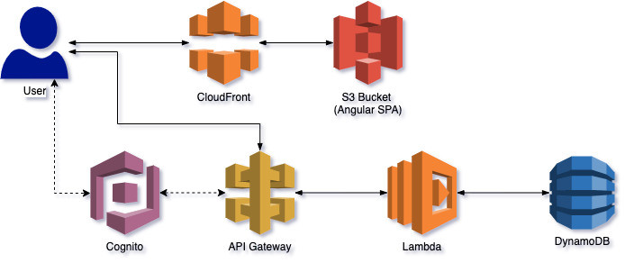

# serverless-app

# TODO
- Setup and initialize DynamoDB using Terraform
- Add CRUD logic on Lambdas
- Add CRUD methods using API gateway
- Make Angular SPA consume the CRUD methods
- Make Angular SPA authenticate on Cognito
- Authentication using Cognito
- Expose Angular SPA using CloudFront
- Publish Angular SPA on S3 using Terraform

# Done
- Use a Angular Material design template of Tour of Heroes application
- Setup Terraform with initial structure

# Credits

- Angular Material Design Template: https://onthecode.co.uk/
- Hero icon https://www.flaticon.com/
